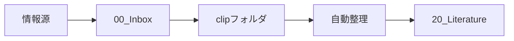
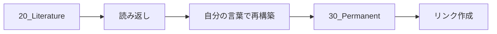
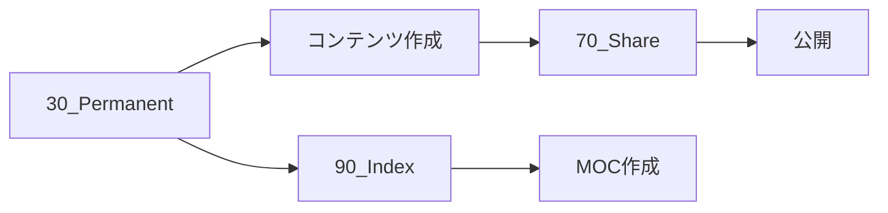

# ワークフロー

## 概要
ObsidianとCursorを連携させた効率的な知識管理ワークフローを定義します。情報の収集から活用までを体系化し、生産性を最大化します。

## メインワークフロー

### 1. 収集フェーズ


### 2. 整理・学習フェーズ


### 3. 活用フェーズ


## 日次ワークフロー

### 朝のルーティン（15分）
1. **Inboxレビュー**
   - 未処理アイテム確認
   - 優先順位付け
   - クイック処理（2分ルール）

2. **Daily Note作成**
   - 今日のタスク
   - 目標設定
   - スケジュール確認

### 中間レビュー（10分）
1. **進捗確認**
   - タスク完了状況
   - 新規情報の処理

2. **clipフォルダ整理**
   ```bash
   python process_clip.py
   ```

### 夕方の振り返り（20分）
1. **学びの整理**
   - Literatureノートのレビュー
   - Permanentノート作成

2. **明日の準備**
   - Inboxのクリア
   - タスクの整理

## 週次ワークフロー

### 週末レビュー（1時間）

#### 1. コンテンツ監査
- [ ] 未処理Literatureの確認
- [ ] Permanentノートの品質チェック
- [ ] リンク切れ確認

#### 2. MOC更新
- [ ] 新規トピックのMOC化
- [ ] 既存MOCの更新
- [ ] タグ整理

#### 3. Shareコンテンツ
- [ ] ブログ記事の企画
- [ ] 下書き作成
- [ ] 公開スケジュール

### 月次レビュー（2時間）

#### 1. システム最適化
- [ ] フォルダ構造の見直し
- [ ] ワークフローの改善
- [ ] 自動化スクリプトの更新

#### 2. 知識の棚卸し
- [ ] 古いノートのアーカイブ
- [ ] 重複コンテンツの統合
- [ ] タグの大整理

## 特別ワークフロー

### プロジェクト開始時
1. プロジェクトMOC作成
2. 関連リソース収集
3. タスクリスト作成
4. 進捗ログ開始

### 学習トピック開始時
1. 学習パスMOC作成
2. リソースリスト作成
3. マイルストーン設定
4. 進捗追跡開始

## 自動化ツール

### Cursorコマンド
```bash
# clip整理
"クリップを整理して"

# フォルダ構造確認
"フォルダ構造を表示して"

# タグ一覧生成
"タグ一覧を作成して"
```

### Pythonスクリプト
- `process_clip.py`: clip自動整理
- 今後追加予定:
  - `generate_moc.py`: MOC自動生成
  - `tag_analyzer.py`: タグ分析
  - `link_checker.py`: リンクチェッカー

## 効率化のTips

### 1. ショートカット
- `Cmd+P`: ファイル検索
- `Cmd+O`: クイックスイッチャー
- `Cmd+Shift+F`: 全文検索

### 2. テンプレート活用
- Daily Noteテンプレート
- 会議メモテンプレート
- プロジェクトテンプレート

### 3. バッチ処理
- 同種タスクのまとめ処理
- 時間帯を固定
- タイマー使用

## 成果指標

### 定量指標
- Inbox処理率: 95%以上
- Literature→Permanent変換率: 30%以上
- 週次ブログ投稿: 1本以上

### 定性指標
- 知識の体系化度
- 検索性の向上
- アウトプットの品質

## 関連ドキュメント
- [[102-01_ユースケース]]
- [[102-02_効率化テクニック]]
- [[110-01_InboxをLiteratureに整理するワークフロー]]
- [[110-02_LiteratureをPermanentに昇華するワークフロー]]
- [[110-03_記事執筆ワークフロー]]