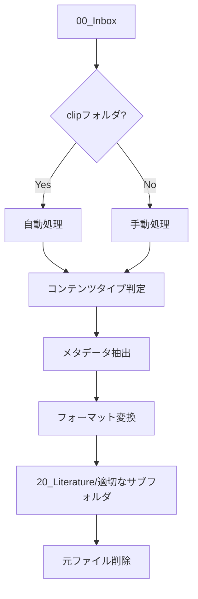
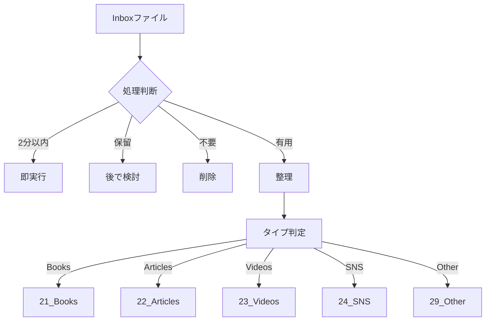

# InboxをLiteratureに整理するワークフロー

## 概要
00_Inboxに蓄積された情報を20_Literatureに整理する具体的な手順を定義します。

## ワークフロー図


## 自動処理（clipフォルダ）

### 1. 実行方法
```bash
# Cursorで実行
"クリップを整理して"

# または直接実行
python 100_cursor/process_clip.py
```

### 2. 処理フロー
1. **ファイル検出**: `00_Inbox/clip/*.md`
2. **コンテンツ読み込み**: 全文をメモリに
3. **タイプ判定**: キーワードマッチング
4. **メタデータ抽出**: タイトル、URL、日付
5. **サマリー生成**: 概要、ポイント、引用
6. **ファイル移動**: 適切なサブフォルダへ
7. **元ファイル削除**: 処理完了後

### 3. コンテンツタイプ判定ルール

| キーワード | フォルダ | 例 |
|------------|---------|-----|
| book, 書籍, 本, ISBN, 著者 | 21_Books | 書籍情報 |
| article, 記事, blog, ブログ, news | 22_Articles | Web記事 |
| video, youtube, 動画, vimeo | 23_Videos | 動画コンテンツ |
| twitter, x.com, facebook, instagram, sns | 24_SNS | SNS投稿 |
| その他 | 29_Other | 未分類 |

## 手動処理（一般ファイル）

### 1. 処理タイミング
- **日次**: 朝と9時・夅18時
- **目標**: 24時間以内に処理

### 2. 処理ステップ

#### ステップ1: レビュー（5分）
```bash
# Inbox内のファイル一覧
ls -la 00_Inbox/
```

#### ステップ2: 分類判断
- コンテンツを開いて確認
- 適切なカテゴリを判断

#### ステップ3: メタデータ追加
```markdown
## メタデータ
- **ソース**: [URLまたは出典]
- **オーナー**: [著者/クリエイター]
- **日付**: YYYY-MM-DD
- **タグ**: #literature #[カテゴリ]
```

#### ステップ4: サマリー作成
- 記事の概要（1-2段落）
- 主要ポイント（3-5個）
- 活用例（1-2個）
- 疑問点・考察（任意）

#### ステップ5: ファイル移動
```bash
# 例: Articlesへ移動
mv "00_Inbox/ファイル名.md" "20_Literature/22_Articles/YYYYMMDD_タイトル.md"
```

### 3. 処理フローチャート



## ベストプラクティス

### 1. ファイル命名
```
# Inbox段階
YYYYMMDD_[簡潔なタイトル].md

# Literature移動後
YYYYMMDD_[詳細タイトル].md
```

### 2. タグ付け
- 必須: #literature
- カテゴリ: #literature/article
- トピック: #tech/react
- ステータス: #processing

### 3. 品質チェック
- [ ] メタデータ完全
- [ ] サマリー作成
- [ ] タグ付け
- [ ] ファイル名適切

## トラブルシューティング

### process_clip.pyが動かない
```bash
# Pythonパス確認
which python3

# 依存関係インストール
pip install pathlib

# 実行権限確認
chmod +x 100_cursor/process_clip.py
```

### ファイルが見つからない
- パスが正しいか確認
- ファイル拡張子が.mdか確認
- 文字エンコーディング確認

### 分類が間違っている
- キーワードルールを調整
- コンテンツの最初の数行を確認
- 手動で移動

## 成果指標

| 指標 | 目標 | 測定方法 |
|------|------|----------|
| 処理率 | 95%以上 | 未処理ファイル数 |
| 処理時間 | 24時間以内 | タイムスタンプ差 |
| 分類精度 | 90%以上 | 正しいフォルダ率 |
| 自動化率 | 70%以上 | clipフォルダ使用率 |

## 関連ドキュメント
- [[110_ワークフロー]]
- [[process_clip.py]]
- [[clip_workflow.md]]