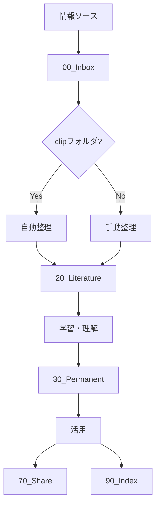

# ワークフロー

## 概要
情報の流れを最適化する具体的なワークフローを定義します。

## メインワークフロー

### 情報の流れ

## 各フェーズの詳細

### 1. 収集フェーズ（Capture）
- **入力**: 外部情報
- **出力**: 00_Inboxのファイル
- **ツール**: ブラウザ拡張、クリップボード
- **時間**: 1分以内

### 2. 整理フェーズ（Organize）
- **入力**: 00_Inboxのファイル
- **出力**: 20_Literatureの整理済みファイル
- **ツール**: process_clip.py
- **時間**: 自動または5分

### 3. 学習フェーズ（Distill）
- **入力**: 20_Literatureのファイル
- **出力**: 30_Permanentのノート
- **ツール**: 思考、分析
- **時間**: 30分～1時間

### 4. 活用フェーズ（Express）
- **入力**: 30_Permanentのノート
- **出力**: 70_Shareのコンテンツ
- **ツール**: 執筆、編集
- **時間**: 1～3時間

## 具体的なワークフロー

- [[110-01_InboxをLiteratureに整理するワークフロー]]
- [[110-02_LiteratureをPermanentに昇華するワークフロー]]
- [[110-03_記事執筆ワークフロー]]

## ワークフロー最適化

### ボトルネックの特定
1. 各フェーズの時間計測
2. ボトルネックの発見
3. 自動化やツール導入

### 改善サイクル
1. **計測**: 各フェーズの時間
2. **分析**: ボトルネックを特定
3. **改善**: プロセスやツールを改良
4. **検証**: 改善効果を測定

## KPI（重要業績評価指標）

| 指標 | 目標 | 現在 |
|------|------|------|
| Inbox処理率 | 95%以上 | - |
| Literature→Permanent変換率 | 30%以上 | - |
| 週次アウトプット | 1本以上 | - |
| 平均処理時間 | 24時間以内 | - |

## 関連ドキュメント
- [[102_ワークフロー]]
- [[103_自動化ルール]]