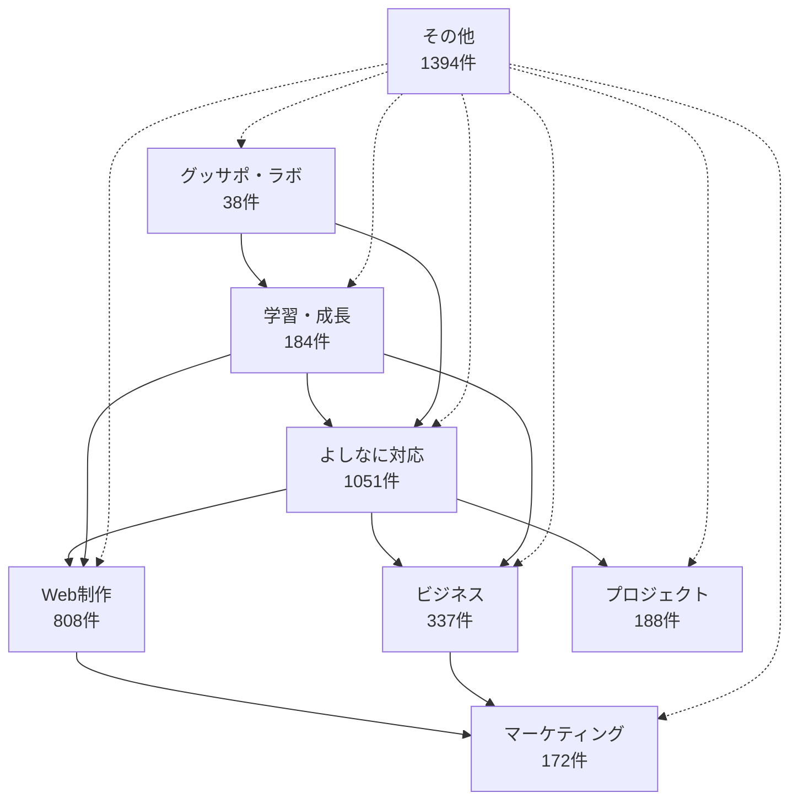

# 🗺️ ナレッジベース カテゴリ関係性マップ

> 8つのカテゴリがどのように連携し、相乗効果を生み出すかを可視化

## 📊 カテゴリ構成



## 🔄 相互関係分析

### 核となる関係性

#### よしなに対応 ↔ Web制作
**関係性**: 相互強化の主軸
- **よしなに対応 → Web制作**: 
  - クライアント満足度向上
  - 品質の高い制作物提供
  - 継続案件獲得
- **Web制作 → よしなに対応**:
  - 技術的な先回り提案
  - 制作プロセスでの配慮
  - 納品後のサポート体制

#### よしなに対応 ↔ ビジネス
**関係性**: 信頼ベースの事業成長
- **よしなに対応 → ビジネス**:
  - 単価向上の基盤
  - 継続的な案件獲得
  - 紹介案件の創出
- **ビジネス → よしなに対応**:
  - 戦略的な顧客対応
  - 利益率を考慮した提案
  - 長期的関係構築

### 支援関係

#### 学習・成長 → 全カテゴリ
**関係性**: 全体の底上げエンジン
- **継続的スキルアップ**: 各分野での専門性向上
- **PDCAサイクル**: 各カテゴリでの改善活動
- **メタ認知**: 自己分析と改善能力

#### グッサポ・ラボ → よしなに対応・学習
**関係性**: コミュニティによる相互成長
- **ナレッジ共有**: 実践事例の蓄積
- **フィードバック**: 客観的な改善点発見
- **モチベーション**: 継続的学習の動機

### シナジー効果

#### Web制作 × マーケティング
**統合効果**: 包括的Webソリューション
- SEO対策込みの制作提案
- アクセス解析を考慮した設計
- 集客につながるUI/UX設計

#### ビジネス × プロジェクト
**統合効果**: 効率的な事業運営
- 案件管理の最適化
- 利益率向上の仕組み化
- チーム連携の強化

## 🎯 戦略的活用パターン

### パターン1: 新規案件獲得
```
よしなに対応 → ビジネス → Web制作 → マーケティング
```
1. よしなに対応で信頼獲得
2. ビジネススキルで高単価提案
3. Web制作で価値提供
4. マーケティングで成果創出

### パターン2: スキル向上サイクル
```
学習・成長 → 実践 → グッサポ・ラボ → フィードバック → 改善
```
1. 新しいスキル習得
2. 実案件での実践
3. コミュニティでの共有
4. 客観的フィードバック
5. さらなる改善

### パターン3: 継続案件の深化
```
よしなに対応 → プロジェクト → Web制作 → ビジネス
```
1. 初回案件でよしなに対応
2. プロジェクト管理で効率化
3. 継続的なWeb制作案件
4. 関係深化でビジネス拡大

## 📈 成長ステージ別活用法

### 初期段階（スキル構築期）
**重点**: 学習・成長 + よしなに対応
- 基礎スキルの習得に集中
- よしなに対応で信頼関係構築
- 小さな案件で実践経験積み重ね

### 成長段階（案件拡大期）
**重点**: Web制作 + ビジネス + プロジェクト
- 制作スキルの向上と実践
- ビジネススキルで単価向上
- プロジェクト管理で効率化

### 成熟段階（事業発展期）
**重点**: マーケティング + グッサポ・ラボ
- マーケティングで新規開拓
- コミュニティでの価値提供
- ナレッジの体系化と共有

## 🔗 重要な相互参照

### よしなに対応起点
- [[../01_よしなに対応/よしなに対応_完全ガイド.md|よしなに対応 完全ガイド]]
- [[../02_Web制作/よしなに対応_Web制作編.md|Web制作でのよしなに対応]]
- [[../04_ビジネス/よしなに対応_ビジネス編.md|ビジネスでのよしなに対応]]

### スキル連携
- [[../02_Web制作/WordPress_ベストプラクティス.md|WordPress技術 × よしなに対応]]
- [[../04_ビジネス/単価UP戦略.md|単価向上 × よしなに対応]]
- [[../03_マーケティング/SEO_実践ガイド.md|SEO × Web制作]]

### 成長サイクル
- [[../05_学習・成長/PDCAサイクル_実践法.md|継続的改善]]
- [[../06_グッサポ・ラボ/コミュニティ活用法.md|ナレッジ共有]]
- [[../07_プロジェクト/効率的案件管理.md|プロジェクト最適化]]

## 🎯 実践への落とし込み

### 日常業務での活用
1. **朝**: よしなに対応チェック + 学習計画
2. **業務中**: Web制作 + プロジェクト管理
3. **夕方**: ビジネス分析 + マーケティング検討
4. **夜**: グッサポ・ラボ活動 + 振り返り

### 週次レビュー
- 各カテゴリの進捗確認
- 相互関係の最適化
- 次週の重点領域決定

### 月次戦略
- カテゴリ間シナジーの評価
- 成長ステージの見直し
- 新しい組み合わせの実験

---

**このマップを活用して、8つのカテゴリの知識を有機的に連携させ、相乗効果を最大化しましょう。**

*更新日: 2025-07-19*
*関連: [[README.md|ナレッジベース インデックス]]*