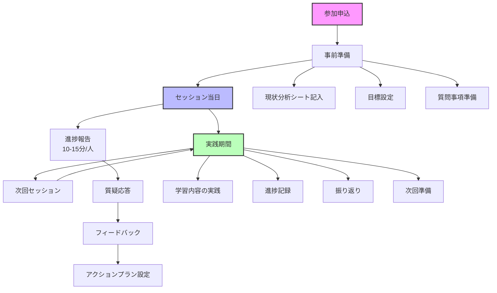
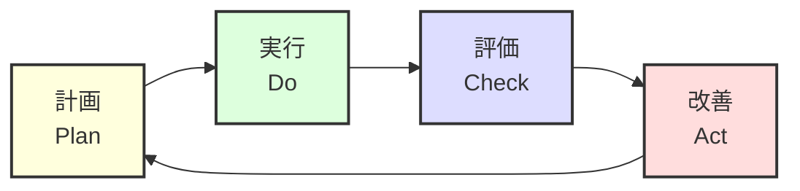

# グッサポ・ラボ グループコンサルワークフロー

#グッサポ #グループコンサル #ワークフロー #プロセス

## ワークフロー概要図



## 詳細フロー

### Phase 1: 参加前準備

#### 1.1 参加申込
- グッサポ・ラボへの参加意思決定
- 申込フォームの提出
- 参加費の支払い（該当する場合）

#### 1.2 オンボーディング
- Discord招待リンクの受領
- グループへの参加
- 自己紹介投稿

#### 1.3 初回準備資料の受領
- 現状分析シートのテンプレート
- 目標設定ガイドライン
- グループコンサルの進め方説明書

### Phase 2: セッション準備（各回共通）

#### 2.1 現状分析（セッション1週間前）
```
□ 現在の案件状況の整理
□ 収益・単価の確認
□ 直面している課題の言語化
□ 前回からの進捗確認（2回目以降）
```

#### 2.2 目標設定（セッション3日前）
```
□ 短期目標（1ヶ月）の設定
□ 中期目標（3ヶ月）の設定
□ 具体的な数値目標の決定
□ 達成のための行動計画案作成
```

#### 2.3 質問準備（セッション前日）
```
□ 最も解決したい課題を3つ選定
□ 具体的な質問文の作成
□ 参考資料の準備（必要に応じて）
□ 画面共有の準備（該当する場合）
```

### Phase 3: セッション当日

#### 3.1 セッション進行タイムライン

```
【開始前】
- 5分前：Discord接続確認
- 3分前：マイク・カメラチェック

【セッション中】
0:00-0:05 - オープニング・今日の流れ確認
0:05-0:20 - 参加者A：進捗報告＆フィードバック
0:20-0:35 - 参加者B：進捗報告＆フィードバック
0:35-0:50 - 参加者C：進捗報告＆フィードバック
0:50-1:00 - 全体まとめ・次回までの宿題確認

【セッション後】
- アーカイブ動画の共有
- フォローアップメッセージ
```

#### 3.2 個人発表の構成（10-15分）

1. **進捗報告（3-5分）**
   - 前回からの実施事項
   - 達成できたこと
   - うまくいかなかったこと

2. **現状の課題共有（3-5分）**
   - 最も困っていること
   - 判断に迷っていること
   - 新たに発生した問題

3. **質疑応答（5-7分）**
   - 講師からの質問
   - 他参加者からの質問
   - 追加情報の提供

### Phase 4: 実践期間（セッション間）

#### 4.1 Week 1: 即実践
```
Day 1-2: アクションプランの詳細化
Day 3-5: 最優先タスクの実行
Day 6-7: 初期成果の確認と調整
```

#### 4.2 Week 2-3: 継続と改善
```
- 日次：実施内容の記録
- 週次：進捗の振り返り
- 随時：Discordでの質問・相談
```

#### 4.3 Week 4: 次回準備
```
- 成果のまとめ
- 新たな課題の整理
- 次回セッションの準備開始
```

### Phase 5: 継続的改善サイクル



## ツール・リソース活用フロー

### コミュニケーションツール
1. **Discord**
   - リアルタイムセッション
   - 日常的な質問・相談
   - 参加者間の交流

2. **Loom**
   - セッションアーカイブ
   - 個別フィードバック動画
   - 実装例の共有

3. **Notion/Obsidian**
   - ドキュメント管理
   - ナレッジベース構築
   - テンプレート共有

### 進捗管理ツール
- 案件管理シート
- 目標達成チェックリスト
- 振り返りテンプレート

## 成功のためのベストプラクティス

### セッション効果を最大化する方法

1. **事前準備の徹底**
   - 具体的な数字を用意
   - 失敗事例も隠さず共有
   - 仮説を持って臨む

2. **積極的な参加**
   - 他者の事例から学ぶ
   - 自分の経験を共有
   - 質問を恐れない

3. **即実践の習慣化**
   - セッション後48時間以内に着手
   - 小さな成功体験を積む
   - 結果を記録する

4. **コミュニティの活用**
   - Discord での日常的な交流
   - 成功事例の共有
   - 相互サポート

## 関連ドキュメント
- [[グループコンサル概要]]
- [[グループコンサル第1回議事録]]
- [[案件管理統合インデックス]]
- [[参加者管理システム設計書]]（作成予定）

---
*最終更新: 2025-07-15*
*このワークフローは継続的に改善されます*