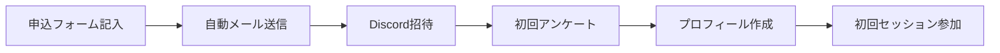
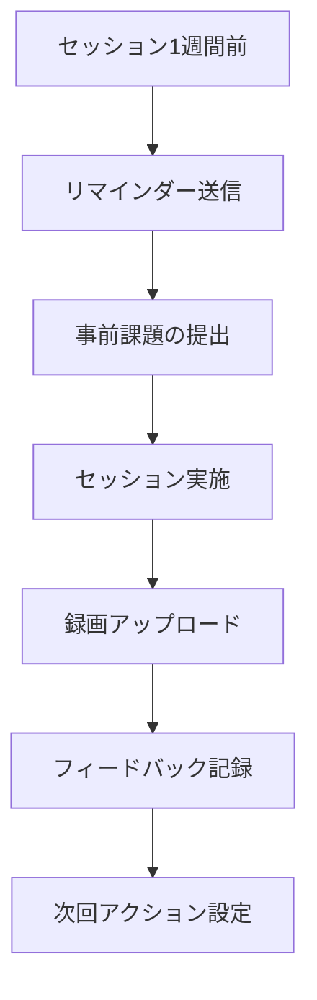

# グッサポ・ラボ 参加者管理システム設計書

#グッサポ #システム設計 #参加者管理 #データベース設計

## システム概要

グッサポ・ラボのグループコンサル参加者を効率的に管理し、各参加者の成長を可視化するためのシステム設計書です。

## システム要件

### 機能要件
1. **参加者情報管理**
   - 基本情報の登録・更新
   - 参加履歴の記録
   - 成果・進捗の追跡

2. **セッション管理**
   - セッションスケジュール管理
   - 出欠管理
   - アーカイブ管理

3. **進捗トラッキング**
   - 目標と実績の記録
   - 成長グラフの可視化
   - マイルストーン管理

4. **コミュニケーション支援**
   - フィードバック履歴
   - 質問・回答の記録
   - リソース共有

### 非機能要件
- データのプライバシー保護
- 簡単な操作性
- モバイル対応
- 定期的なバックアップ

## データモデル設計

### 参加者（Participants）
```yaml
Participant:
  id: string (UUID)
  name: string
  email: string
  discord_id: string
  joined_date: date
  status: enum [active, paused, completed, withdrawn]
  profile:
    background: string
    current_situation: string
    specialties: array[string]
    goals: array[string]
  metadata:
    created_at: timestamp
    updated_at: timestamp
```

### セッション（Sessions）
```yaml
Session:
  id: string (UUID)
  session_number: integer
  date: datetime
  type: enum [regular, special, makeup]
  participants: array[participant_id]
  agenda: string
  materials: array[url]
  recording:
    loom_url: string
    duration: integer
    transcription: text
  metadata:
    created_at: timestamp
    updated_at: timestamp
```

### 進捗記録（Progress）
```yaml
Progress:
  id: string (UUID)
  participant_id: string
  session_id: string
  metrics:
    revenue: integer
    client_count: integer
    project_count: integer
    hourly_rate: integer
  achievements: array[string]
  challenges: array[string]
  action_items: array[
    {
      description: string
      due_date: date
      status: enum [pending, in_progress, completed]
    }
  ]
  metadata:
    created_at: timestamp
    updated_at: timestamp
```

### フィードバック（Feedback）
```yaml
Feedback:
  id: string (UUID)
  session_id: string
  from_participant_id: string
  to_participant_id: string
  type: enum [mentor, peer, self]
  content: text
  tags: array[string]
  visibility: enum [private, group, public]
  metadata:
    created_at: timestamp
    updated_at: timestamp
```

## システムアーキテクチャ

### 技術スタック案

#### Option 1: Notion Based System
```
利点:
- 既存のNotionエコシステムとの統合
- ノーコードで実装可能
- コラボレーション機能が充実

実装方法:
- Notion Database による管理
- Notion API での自動化
- Zapier/Make での連携
```

#### Option 2: Google Workspace Based
```
利点:
- Google Forms でのデータ収集
- Google Sheets での管理
- Apps Script での自動化

実装方法:
- Forms → Sheets → Data Studio
- Apps Script でのワークフロー自動化
- Google Sites でのダッシュボード
```

#### Option 3: Custom Web Application
```
利点:
- 完全なカスタマイズ性
- スケーラビリティ
- 高度な分析機能

技術スタック:
- Frontend: Next.js + TypeScript
- Backend: Node.js + Express
- Database: PostgreSQL
- Hosting: Vercel + Supabase
```

## 実装フェーズ

### Phase 1: MVP（最小実装）
1. **参加者基本情報管理**
   - Googleフォームでの登録
   - スプレッドシートでの管理
   - 基本的な検索・フィルタ

2. **セッション記録**
   - 出欠管理
   - 簡易的なメモ機能
   - Loomリンクの保存

### Phase 2: 機能拡張
1. **進捗ダッシュボード**
   - 個人別の成長グラフ
   - 目標達成率の可視化
   - 比較分析機能

2. **自動化機能**
   - リマインダー送信
   - レポート自動生成
   - フィードバック収集

### Phase 3: 高度化
1. **AI分析機能**
   - 成功パターンの抽出
   - 個別最適化された提案
   - 予測分析

2. **コミュニティ機能**
   - 参加者間のマッチング
   - ナレッジ共有プラットフォーム
   - 成功事例データベース

## 運用フロー

### 新規参加者登録フロー


### セッション運用フロー


## データ活用例

### 1. 個人レポート
- 月次成長レポート
- 目標達成度分析
- 強み・改善点の可視化

### 2. グループ分析
- 成功パターンの特定
- ベストプラクティスの抽出
- 相互学習の促進

### 3. プログラム改善
- カリキュラムの最適化
- サポート体制の強化
- 新規コンテンツの開発

## セキュリティ・プライバシー

### データ保護方針
1. **個人情報の取り扱い**
   - 最小限の情報収集
   - 暗号化による保護
   - アクセス権限の管理

2. **データの利用範囲**
   - 本人の同意に基づく利用
   - 匿名化された分析
   - 第三者提供の禁止

3. **バックアップ体制**
   - 定期的な自動バックアップ
   - 複数拠点での保管
   - リカバリー手順の文書化

## 導入スケジュール案

### Month 1-2: 要件定義と設計
- ステークホルダーヒアリング
- 詳細設計書の作成
- 技術選定

### Month 3-4: 開発とテスト
- MVP開発
- ユーザーテスト
- フィードバック反映

### Month 5-6: 本番導入
- データ移行
- 運用マニュアル作成
- トレーニング実施

## 成功指標（KPI）

1. **システム利用率**
   - アクティブユーザー率: 90%以上
   - データ入力完了率: 95%以上

2. **業務効率化**
   - 管理時間: 50%削減
   - レポート作成時間: 70%削減

3. **参加者満足度**
   - システム満足度: 4.5/5.0以上
   - 進捗可視化への評価: 4.0/5.0以上

## 関連ドキュメント
- [[グループコンサル概要]]
- [[グループコンサルワークフロー]]
- [[フィードバック収集システム構築案]]（作成予定）
- [[案件管理統合インデックス]]

---
*最終更新: 2025-07-15*
*この設計書は要件に応じて更新されます*